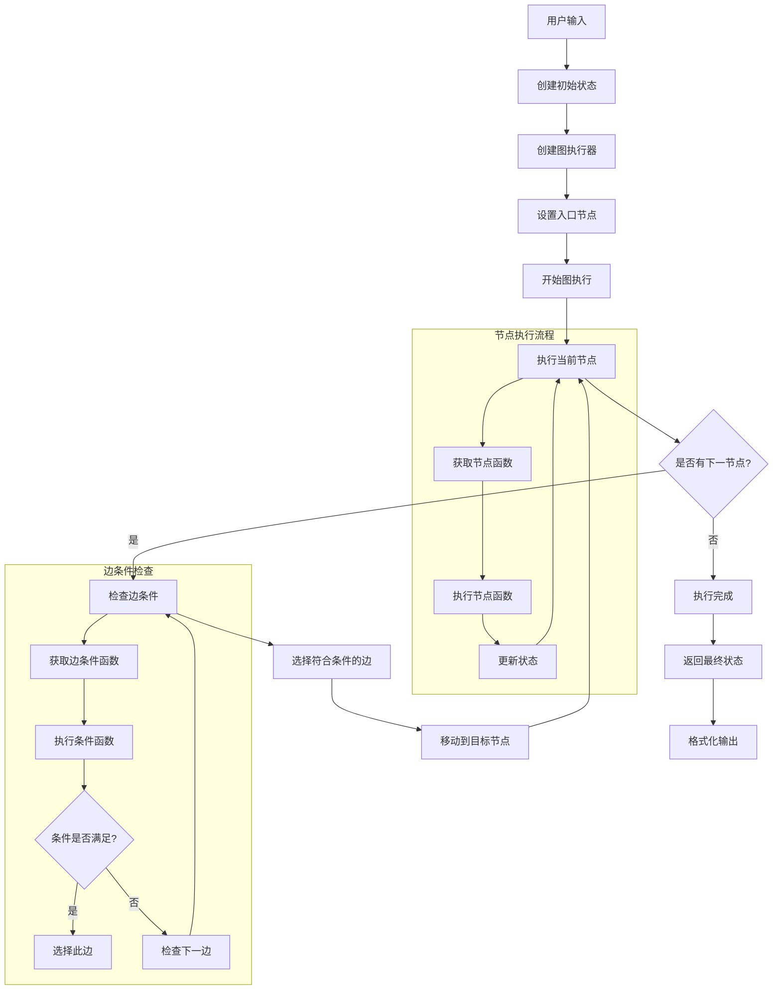
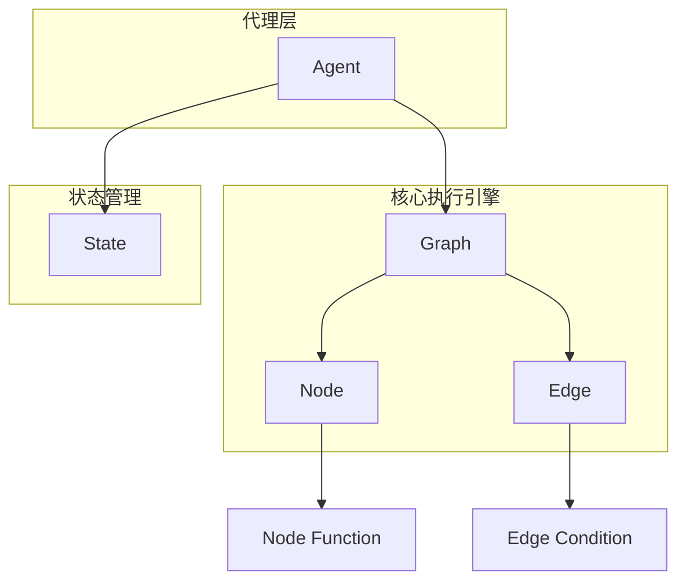
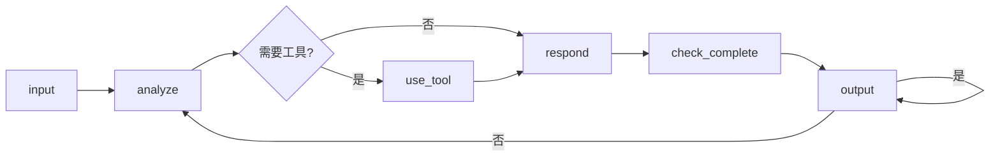

# 核心程序执行流程图

## 流程图

```mermaid
flowchart TD
    A[用户输入] --> B[创建初始状态]
    B --> C[创建图执行器]
    C --> D[设置入口节点]
    D --> E[开始图执行]
    
    E --> F[执行当前节点]
    F --> G{是否有下一节点?}
    G -->|是| H[检查边条件]
    H --> I[选择符合条件的边]
    I --> J[移动到目标节点]
    J --> F
    
    G -->|否| K[执行完成]
    K --> L[返回最终状态]
    L --> M[格式化输出]
    
    subgraph 节点执行流程
        F --> F1[获取节点函数]
        F1 --> F2[执行节点函数]
        F2 --> F3[更新状态]
        F3 --> F
    end
    
    subgraph 边条件检查
        H --> H1[获取边条件函数]
        H1 --> H2[执行条件函数]
        H2 --> H3{条件是否满足?}
        H3 -->|是| H4[选择此边]
        H3 -->|否| H5[检查下一边]
        H5 --> H
    end
```

## 核心组件交互

```mermaid
graph TD
    A[Agent] --> B[Graph]
    A --> C[State]
    B --> D[Node]
    B --> E[Edge]
    D --> F[Node Function]
    E --> G[Edge Condition]
    
    subgraph 核心执行引擎
        B
        D
        E
    end
    
    subgraph 状态管理
        C
    end
    
    subgraph 代理层
        A
    end
```

## SimpleAgent 图结构

```mermaid
flowchart LR
    input[input] --> analyze[analyze]
    analyze --> tool{需要工具?}
    tool -->|是| use_tool[use_tool]
    tool -->|否| respond[respond]
    use_tool --> respond
    respond --> check_complete[check_complete]
    check_complete --> output{完成?}
    output -->|是| output[output]
    output -->|否| analyze
```